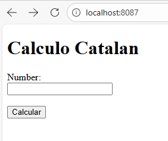
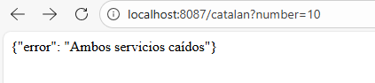
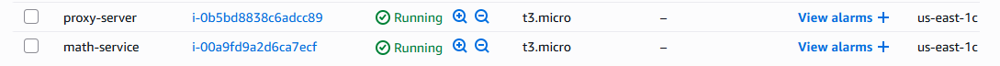
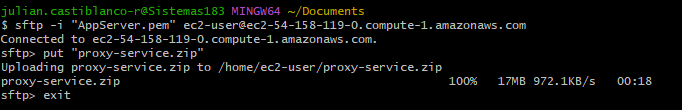
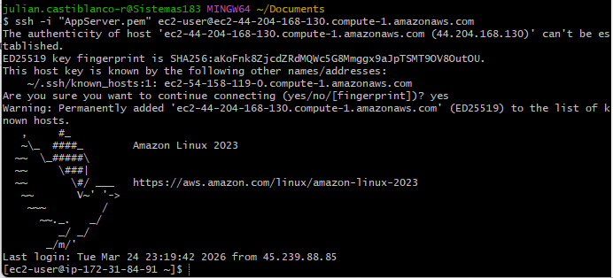
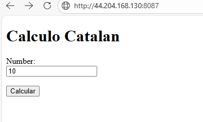

**Numeros Catalan Parcial**

El cotenido de este repositorio se basa en una arquitectura Proxy y service, la cual el proxy se encargara de recibir las solicitudes para que el microsericio que computa las operaciones 
del numero de catalan reciba solo la accion de calculo y asi pueda generar el output de estas mismas.
Funcionamiento:

---
1. en local podemos ver que el proxy funciona correctamente:
- 
2. Cuando falla y no encuentra el service
- 
3. vemos como se muestra el calculo de los numeros de catalan:

---
**como ejecutar localmente:**
para poder correr esto de forma local tenemos que entrar al directorio de cada uno de los proyectos y ejecutar 'mvn clean install' para que se 
instalen todos los paquetes del pom correctamente y luego para correr los projectos usaremos mvn 'spring-boot:run'
y con esto tenndremos los proyectos corriendo, para despues abrir 'localhost:8087' que es el perteneciente a el proxy-service y de ahi hacer los calculos correspondientes
---
**Despliegue en AWS**
1. primero crearemos las instancias correspondientes en aws:
- 
2. Despues comprimimos el proyecto a un zip para pasarlo a la instancia con sftp:
- 
3. Luego accederemos a la terminal con ssh:
- 
4. Instalaremos por comando la version de java y maven:
   - sudo yum install java-17-amazon-corretto-headless
5. Correremos con la ip nuestro codigo para verificar que si esta funcionando:

Estos mismos pasos los haremos con mathService, pero en el caso de mathService no pondremos la ip en el navegador sino
en el proxy, para que este dirija correctamente y haga los calculos correctos
